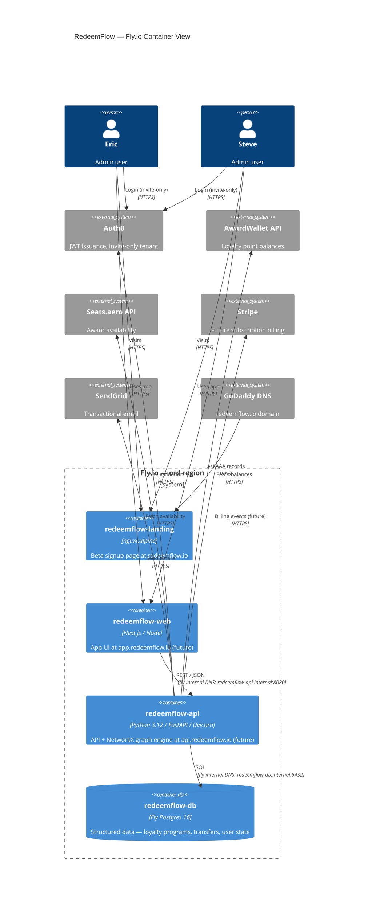

# RedeemFlow — Fly.io Deployment Architecture

**Date:** 2026-03-08
**Scope:** 2-user private beta, POSIX (arm64 preferred)

---

## Architecture Diagram



---

## Component Inventory

| App | Runtime | Region | Machine | RAM | CPU | Scaling | Est. $/mo |
|-----|---------|--------|---------|-----|-----|---------|-----------|
| `redeemflow-landing` | nginx:alpine | ord | shared-cpu-1x | 256MB | 1 vCPU | min 1, max 1 | ~$1.94 |
| `redeemflow-web` | node:20-alpine | ord | shared-cpu-1x | 512MB | 1 vCPU | min 0, max 2 | ~$3.88 (stopped when idle via `auto_stop`) |
| `redeemflow-api` | python:3.12-slim | ord | shared-cpu-2x | 1GB | 2 vCPU | min 1, max 2 | ~$7.76 (NetworkX keeps it alive) |
| `redeemflow-db` | Postgres 16 (Fly managed) | ord | shared-cpu-1x | 1GB | 1 vCPU | Single node | ~$7.44 |
| **Total** | | | | | | | **~$21/mo** |

Pricing basis: Fly.io 2025 shared-cpu rates. `auto_stop = true` on web drops to ~$0 when unused.

---

## App Configuration

### redeemflow-landing — `fly.toml`

```toml
app = "redeemflow-landing"
primary_region = "ord"

[build]
  image = "nginx:alpine"

[http_service]
  internal_port = 80
  force_https = true
  auto_stop_machines = false
  auto_start_machines = true
  min_machines_running = 1

  [[http_service.checks]]
    grace_period = "5s"
    interval = "15s"
    method = "GET"
    path = "/"
    timeout = "5s"

[[vm]]
  memory = "256mb"
  cpu_kind = "shared"
  cpus = 1
```

Deploy command:
```bash
fly launch --name redeemflow-landing --region ord --no-deploy
fly deploy --app redeemflow-landing
fly certs add redeemflow.io --app redeemflow-landing
fly certs add www.redeemflow.io --app redeemflow-landing
```

---

### redeemflow-api — `fly.toml`

```toml
app = "redeemflow-api"
primary_region = "ord"

[build]
  dockerfile = "Dockerfile"

[env]
  PORT = "8080"
  PYTHONUNBUFFERED = "1"
  LOG_LEVEL = "info"
  AUTH0_DOMAIN = "redeemflow.us.auth0.com"
  AUTH0_AUDIENCE = "https://api.redeemflow.io"

[http_service]
  internal_port = 8080
  force_https = true
  auto_stop_machines = false
  auto_start_machines = true
  min_machines_running = 1

  [[http_service.checks]]
    grace_period = "10s"
    interval = "30s"
    method = "GET"
    path = "/health"
    timeout = "10s"

[[vm]]
  memory = "1gb"
  cpu_kind = "shared"
  cpus = 2
```

Deploy command:
```bash
fly launch --name redeemflow-api --region ord --no-deploy
fly postgres attach redeemflow-db --app redeemflow-api
fly deploy --app redeemflow-api
# custom domain (future — not needed yet)
# fly certs add api.redeemflow.io --app redeemflow-api
```

---

### redeemflow-web — `fly.toml`

```toml
app = "redeemflow-web"
primary_region = "ord"

[build]
  dockerfile = "Dockerfile"

[env]
  NODE_ENV = "production"
  NEXT_PUBLIC_API_URL = "https://redeemflow-api.fly.dev"  # update to api.redeemflow.io when DNS live

[http_service]
  internal_port = 3000
  force_https = true
  auto_stop_machines = true
  auto_start_machines = true
  min_machines_running = 0

  [[http_service.checks]]
    grace_period = "10s"
    interval = "30s"
    method = "GET"
    path = "/"
    timeout = "10s"

[[vm]]
  memory = "512mb"
  cpu_kind = "shared"
  cpus = 1
```

Deploy command:
```bash
fly launch --name redeemflow-web --region ord --no-deploy
fly deploy --app redeemflow-web
# custom domain (future)
# fly certs add app.redeemflow.io --app redeemflow-web
```

---

### redeemflow-db — Provisioning

```bash
# Create Postgres cluster
fly postgres create \
  --name redeemflow-db \
  --region ord \
  --vm-size shared-cpu-1x \
  --volume-size 10 \
  --initial-cluster-size 1 \
  --password-auth

# Attach to API app (sets DATABASE_URL secret automatically)
fly postgres attach redeemflow-db --app redeemflow-api

# Connect directly for schema migrations
fly postgres connect --app redeemflow-db
```

---

## Secrets Management

All secrets are set via `fly secrets set`. Never commit values to source control.

### redeemflow-api secrets

```bash
# Auth0
fly secrets set \
  AUTH0_CLIENT_ID="<auth0_client_id>" \
  AUTH0_CLIENT_SECRET="<auth0_client_secret>" \
  AUTH0_DOMAIN="redeemflow.us.auth0.com" \
  AUTH0_AUDIENCE="https://api.redeemflow.io" \
  --app redeemflow-api

# External APIs
fly secrets set \
  AWARDWALLET_API_KEY="<key>" \
  SEATSAERO_API_KEY="<key>" \
  --app redeemflow-api

# Email
fly secrets set \
  SENDGRID_API_KEY="<key>" \
  FROM_EMAIL="notifications@redeemflow.io" \
  --app redeemflow-api

# Stripe (future — set when billing goes live)
fly secrets set \
  STRIPE_SECRET_KEY="sk_live_..." \
  STRIPE_WEBHOOK_SECRET="whsec_..." \
  --app redeemflow-api

# DATABASE_URL is set automatically by `fly postgres attach`
```

### redeemflow-web secrets

```bash
fly secrets set \
  AUTH0_CLIENT_ID="<web_client_id>" \
  AUTH0_CLIENT_SECRET="<web_client_secret>" \
  AUTH0_ISSUER_BASE_URL="https://redeemflow.us.auth0.com" \
  AUTH0_BASE_URL="https://app.redeemflow.io" \
  AUTH0_SECRET="<random_32_byte_string>" \
  NEXT_PUBLIC_API_URL="https://redeemflow-api.fly.dev" \
  --app redeemflow-web
```

View current secrets (names only, no values):
```bash
fly secrets list --app redeemflow-api
fly secrets list --app redeemflow-web
```

---

## Networking

### Internal DNS (Fly private network)

Fly apps in the same organization communicate via WireGuard mesh. No public internet required.

| From | To | Internal Address | Port |
|------|----|-----------------|------|
| `redeemflow-web` | `redeemflow-api` | `redeemflow-api.internal` | 8080 |
| `redeemflow-api` | `redeemflow-db` | `redeemflow-db.internal` | 5432 |

`DATABASE_URL` format after `fly postgres attach`:
```
postgres://redeemflow_api:<password>@redeemflow-db.internal:5432/redeemflow_api
```

Set `NEXT_PUBLIC_API_URL` to the internal address for server-side Next.js calls. Browser calls still need the public URL.

### Custom Domain Setup

Custom domain certs are issued by Fly after DNS records point to Fly. Process per domain:
1. Add cert in Fly: `fly certs add <domain> --app <app-name>`
2. Fly shows required DNS records
3. Add those records in GoDaddy
4. Fly validates and issues cert (Let's Encrypt, auto-renews)

---

## DNS Configuration (GoDaddy)

All records are in the GoDaddy DNS manager for `redeemflow.io`.

### Active Now — redeemflow.io (landing page)

After running `fly certs add redeemflow.io --app redeemflow-landing`, Fly returns the IP.
Get the IP: `fly ips list --app redeemflow-landing`

| Type | Name | Value | TTL |
|------|------|-------|-----|
| A | `@` | `<fly_ipv4_from_ips_list>` | 300 |
| AAAA | `@` | `<fly_ipv6_from_ips_list>` | 300 |
| A | `www` | `<fly_ipv4_from_ips_list>` | 300 |
| AAAA | `www` | `<fly_ipv6_from_ips_list>` | 300 |

Verify cert status:
```bash
fly certs show redeemflow.io --app redeemflow-landing
```

### Future — app.redeemflow.io (web app)

When ready to go live with the app:
```bash
fly certs add app.redeemflow.io --app redeemflow-web
fly ips list --app redeemflow-web
```

| Type | Name | Value | TTL |
|------|------|-------|-----|
| A | `app` | `<fly_ipv4_from_ips_list>` | 300 |
| AAAA | `app` | `<fly_ipv6_from_ips_list>` | 300 |

### Future — api.redeemflow.io (API)

When third-party clients or mobile need direct API access:
```bash
fly certs add api.redeemflow.io --app redeemflow-api
fly ips list --app redeemflow-api
```

| Type | Name | Value | TTL |
|------|------|-------|-----|
| A | `api` | `<fly_ipv4_from_ips_list>` | 300 |
| AAAA | `api` | `<fly_ipv6_from_ips_list>` | 300 |

---

## Auth Model

**Auth0 tenant:** `redeemflow.us.auth0.com`
**Registration:** Disabled (invite-only). Connection type: Email/Password or Google OAuth.

### Auth0 Setup

```
Tenant settings → Advanced → Disable "Allow sign-ups"
Applications:
  - redeemflow-web (Regular Web App) — Next.js frontend
  - redeemflow-api (API) — machine-to-machine + JWT audience
```

### User Provisioning (invite-only)

Eric and Steve are created manually in the Auth0 dashboard. No public signup flow.

```
Auth0 Dashboard → User Management → Users → Create User
  Email: eric@...
  Set password → Send invitation email
  (repeat for Steve)
```

When you want to add a third user later, same process. To permanently block signups, disable the Database Connection's "Requires Username" + enable "Disable Sign Ups" in the Connection settings.

### JWT Validation in API

FastAPI middleware validates every request:

```python
# api/auth.py
import jwt
from jwt import PyJWKClient

JWKS_URL = f"https://{AUTH0_DOMAIN}/.well-known/jwks.json"
jwks_client = PyJWKClient(JWKS_URL)

def verify_token(token: str) -> dict:
    signing_key = jwks_client.get_signing_key_from_jwt(token)
    payload = jwt.decode(
        token,
        signing_key.key,
        algorithms=["RS256"],
        audience=AUTH0_AUDIENCE,
        issuer=f"https://{AUTH0_DOMAIN}/",
    )
    return payload
```

No role-based access needed at 2-user scale. Both Eric and Steve are admins by default.

---

## Deployment Pipeline (GitHub Actions)

File: `.github/workflows/deploy.yml`

```yaml
name: Deploy to Fly.io

on:
  push:
    branches: [main]

jobs:
  deploy-landing:
    name: Deploy landing
    runs-on: ubuntu-latest
    if: contains(github.event.head_commit.modified, 'landing/')
    steps:
      - uses: actions/checkout@v4
      - uses: superfly/flyctl-actions/setup-flyctl@master
      - run: fly deploy --app redeemflow-landing --config landing/fly.toml
        env:
          FLY_API_TOKEN: ${{ secrets.FLY_API_TOKEN }}

  deploy-api:
    name: Deploy API
    runs-on: ubuntu-latest
    if: contains(github.event.head_commit.modified, 'api/')
    steps:
      - uses: actions/checkout@v4
      - uses: superfly/flyctl-actions/setup-flyctl@master
      - run: fly deploy --app redeemflow-api --config api/fly.toml
        env:
          FLY_API_TOKEN: ${{ secrets.FLY_API_TOKEN }}

  deploy-web:
    name: Deploy web
    runs-on: ubuntu-latest
    if: contains(github.event.head_commit.modified, 'web/')
    steps:
      - uses: actions/checkout@v4
      - uses: superfly/flyctl-actions/setup-flyctl@master
      - run: fly deploy --app redeemflow-web --config web/fly.toml
        env:
          FLY_API_TOKEN: ${{ secrets.FLY_API_TOKEN }}
```

Get `FLY_API_TOKEN`:
```bash
fly tokens create deploy -x 999999h
# Add output as FLY_API_TOKEN in GitHub repo → Settings → Secrets → Actions
```

For simpler single-commit deploys (all apps on every push):

```yaml
  deploy-all:
    name: Deploy all apps
    runs-on: ubuntu-latest
    steps:
      - uses: actions/checkout@v4
      - uses: superfly/flyctl-actions/setup-flyctl@master
      - run: |
          fly deploy --app redeemflow-landing --config landing/fly.toml
          fly deploy --app redeemflow-api --config api/fly.toml
          fly deploy --app redeemflow-web --config web/fly.toml
        env:
          FLY_API_TOKEN: ${{ secrets.FLY_API_TOKEN }}
```

---

## Cost Estimate

### 2-User Scale (current)

| Component | Machine | $/mo |
|-----------|---------|------|
| redeemflow-landing | shared-cpu-1x 256MB, always-on | $1.94 |
| redeemflow-api | shared-cpu-2x 1GB, always-on | $7.76 |
| redeemflow-web | shared-cpu-1x 512MB, auto-stop | ~$1–4 (usage-based) |
| redeemflow-db | shared-cpu-1x 1GB, 10GB volume | $7.44 + $0.15/GB = ~$9 |
| Fly Postgres backup storage | — | ~$1 |
| **Total** | | **~$21–25/mo** |

Fly charges for machine uptime (not requests). `auto_stop = true` on the web app drops it to ~$0 when neither Eric nor Steve is logged in.

### 100-User Scale

Changes needed:
- `redeemflow-api`: upgrade to `performance-1x` 2GB RAM ($22.96/mo) to handle concurrent NetworkX computations
- `redeemflow-db`: upgrade to dedicated-cpu-1x 1GB ($46.82/mo) + 25GB volume
- `redeemflow-web`: increase `min_machines_running = 1`, increase `max_machines_running = 3`
- Add read replica for Postgres if query load increases

Estimated total: ~$80–100/mo

### 1000-User Scale

Changes needed:
- `redeemflow-api`: move to `performance-2x` 4GB or 2 machines with Fly load balancing
- Add Redis (Upstash or Fly Redis) for caching NetworkX results and rate limiting AwardWallet/Seats.aero calls
- `redeemflow-db`: dedicated cluster with replica (primary + 1 standby, ~$150/mo)
- NetworkX graph computations may need result caching (TTL per user, per program combination)
- Auth0 plan: free tier covers 7,500 active users — no Auth0 cost change at 1,000

Estimated total: ~$250–400/mo

---

## Operational Commands

```bash
# Status
fly status --app redeemflow-api
fly logs --app redeemflow-api
fly logs --app redeemflow-api --instance <instance_id>

# SSH into a running machine
fly ssh console --app redeemflow-api

# Scale manually
fly scale count 2 --app redeemflow-api
fly scale memory 2048 --app redeemflow-api

# Database access
fly postgres connect --app redeemflow-db
fly postgres db list --app redeemflow-db

# Cert status
fly certs list --app redeemflow-landing
fly certs show redeemflow.io --app redeemflow-landing

# Secrets (names only)
fly secrets list --app redeemflow-api
```

---

## Repository Layout

Suggested monorepo layout matching the three apps:

```
redeemflow/
├── landing/
│   ├── fly.toml
│   ├── nginx.conf
│   └── static/         ← index.html, assets
├── api/
│   ├── fly.toml
│   ├── Dockerfile
│   ├── pyproject.toml
│   └── src/
│       ├── main.py
│       ├── auth.py
│       ├── graph/      ← NetworkX engine
│       └── routes/
├── web/
│   ├── fly.toml
│   ├── Dockerfile
│   ├── package.json
│   └── src/
├── infra/
│   └── architecture.md  ← this file
└── .github/
    └── workflows/
        └── deploy.yml
```

---

## Bootstrap Sequence (first deploy)

Run once, in order:

```bash
# 1. Install flyctl
brew install flyctl
fly auth login

# 2. Provision database first (API depends on it)
fly postgres create \
  --name redeemflow-db \
  --region ord \
  --vm-size shared-cpu-1x \
  --volume-size 10 \
  --initial-cluster-size 1

# 3. Deploy landing page
cd landing
fly launch --name redeemflow-landing --region ord --copy-config --no-deploy
fly deploy
fly certs add redeemflow.io
fly certs add www.redeemflow.io
fly ips list  # copy IPs → GoDaddy A/AAAA records

# 4. Deploy API
cd ../api
fly launch --name redeemflow-api --region ord --copy-config --no-deploy
fly postgres attach redeemflow-db --app redeemflow-api
# Set all secrets (see Secrets Management section)
fly deploy

# 5. Deploy web
cd ../web
fly launch --name redeemflow-web --region ord --copy-config --no-deploy
# Set Auth0 secrets
fly deploy

# 6. Verify
fly status --app redeemflow-landing
fly status --app redeemflow-api
fly status --app redeemflow-web
curl https://redeemflow-api.fly.dev/health
```
